**OVERVIEW**
===

R.U.D.I requires CircuitPython from Adafruit. Circuit Python comes with the python OS, but you should make sure it is installed, and that I2C is working. You may need to turn on I2C at the hardware level.

Check by using
>ls /dev/i2c*

You should get a response like
>/dev/i2c-1

To view what is attached to the pi via I2C

>sudo i2cdetect -y 1

*Note*: This does not detect buttons and sensors, but only what's on the I2C bus

Requirements
---

Circuit Python comes with the python OS, but here are the direct downloads.\
<https://circuitpython.org/downloads>\
<https://circuitpython.org/board/raspberrypi_pi4b/>

Documemtation
---

To install CircuitPython\
<https://learn.adafruit.com/circuitpython-on-raspberrypi-linux/installing-circuitpython-on-raspberry-pi>

Overview\
<https://learn.adafruit.com/welcome-to-circuitpython>

Docs\
<https://docs.circuitpython.org/en/latest/README.html>

Skematic

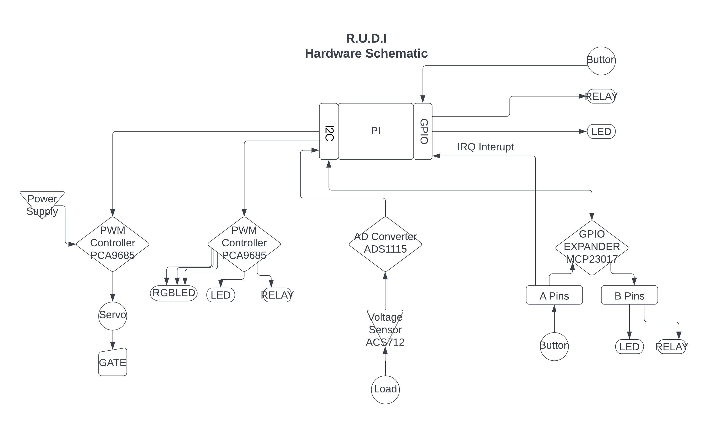

\
\
**HARDWARE**
===

\
\
**-------------------------INPUT-------------------------**
-----

\
\
**---BUTTON---**
-----

[Rugged Metal Momentary Pushbutton **RGBLED**](https://www.adafruit.com/product/3423) *or* [Rugged Metal Momentary Pushbutton **LED**](https://www.adafruit.com/product/481)

They button needs to be connected to an input on the PI or a GPIO Expander.

The two inner set of spade contacts are a normally-closed switch. When you press the button, these contacts will open. The outer two spade contacts are a normally-open switch. When you press the button, these contacts will open until it is released.

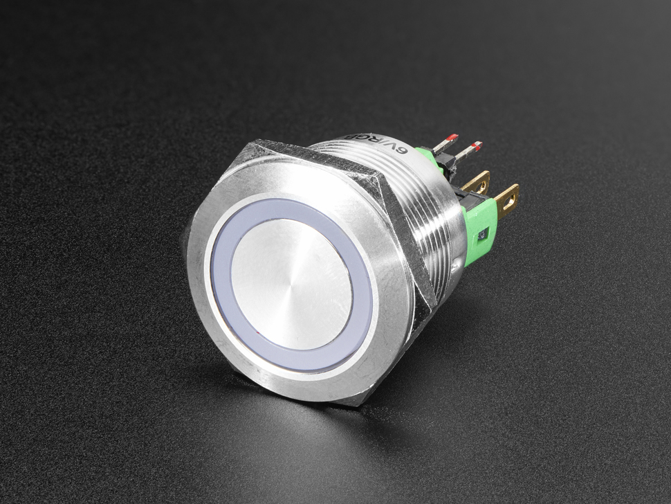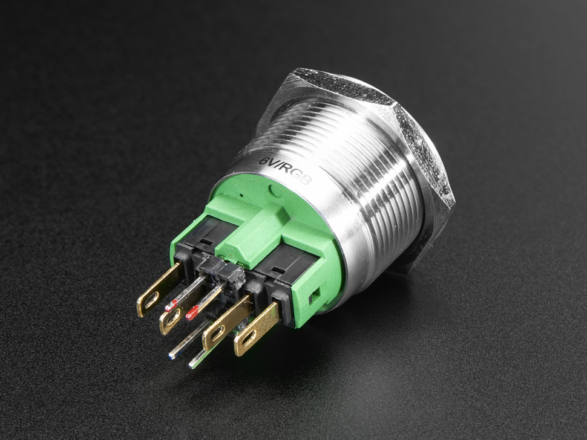

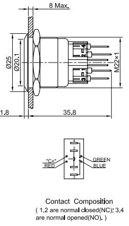

*or*

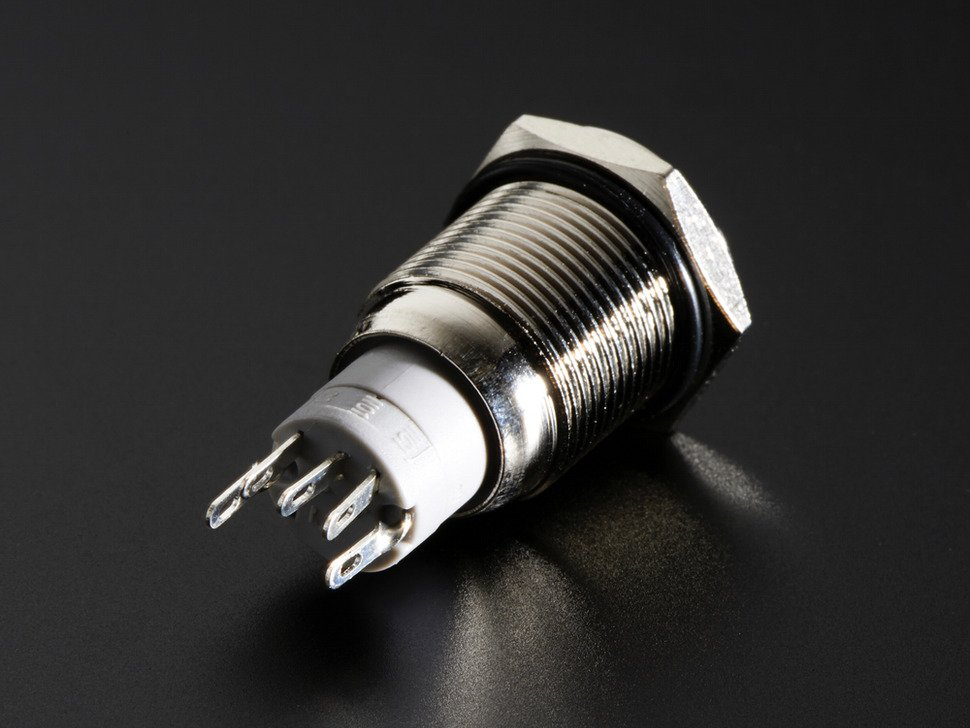

\
\
**---VOLTAGE SENSOR---**
----

[ACS712 (comes in 5A 20A 30A)](https://www.amazon.com/Current-Sensor-ACS712-Module-Arduino/dp/B08R5RBNFK/?th=1)

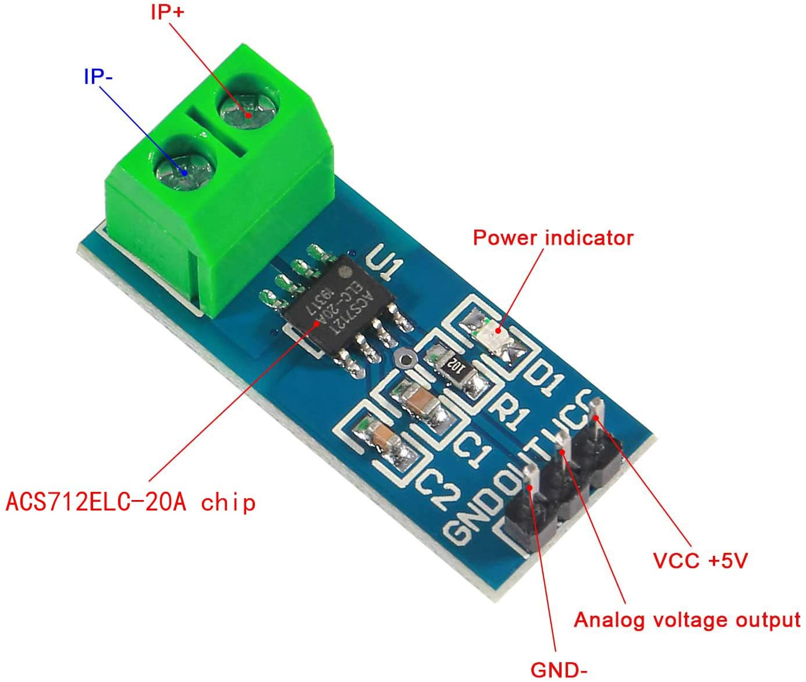

Used in conjunction with a DA Converter (see below)

\
\
**---AD CONVERTER---**
---

[ADS1115 (16 bit)](https://www.adafruit.com/product/1085) or [ADS1105 (12 bit)](https://www.adafruit.com/product/1083)

4 Channel Analog Digital converter over I2C\
(Connect a AC712 to get a reading)

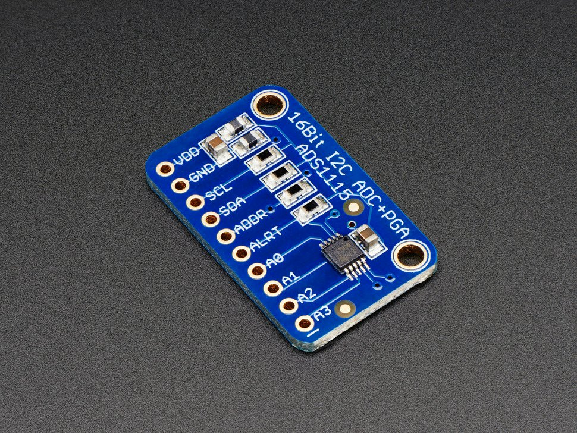

I2C address = 0x48 (72) - 0x4B (75)\
pins = P0 - P3

Required
---

>sudo pip3 install adafruit-circuitpython-ads1x15

Documentation
---

<https://learn.adafruit.com/adafruit-4-channel-adc-breakouts/overview>\
<https://docs.circuitpython.org/projects/ads1x15/en/latest/>

\
\
**----------------INPUT - OUTPUT----------------**
------

**----GPIO Expander---**
---

MCP24008 (8 channel) *or* [Adafruit MCP23017 (16 channel) bonnet](https://www.adafruit.com/product/4132)

*Note*: This device can be used for INPUT and OUTPUT

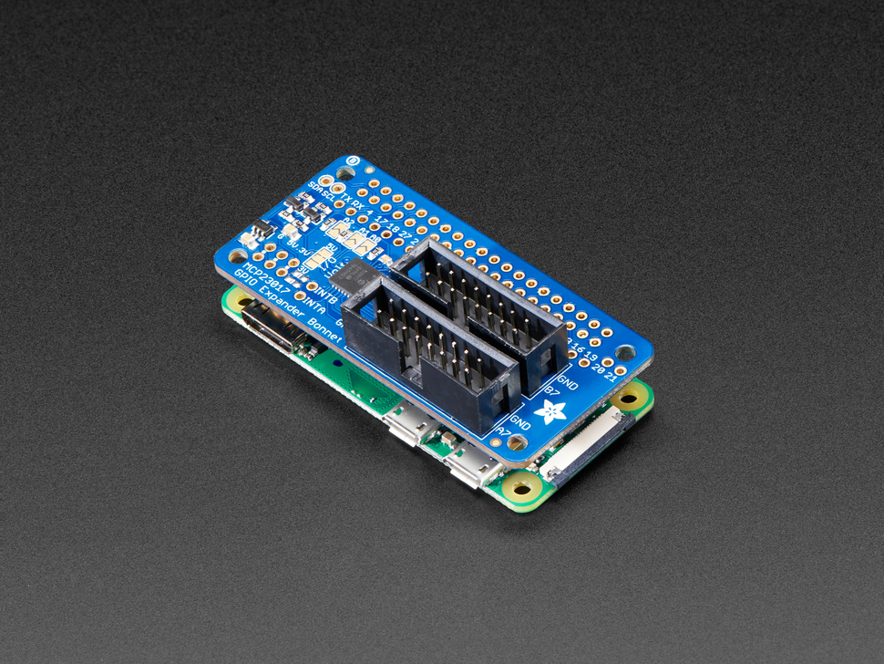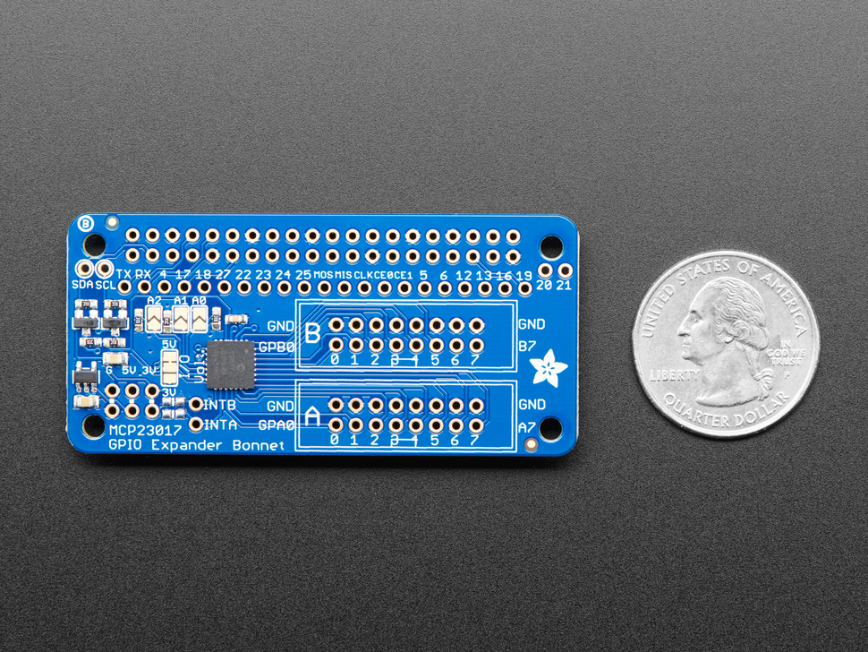

I2C address = 0x20 (32) - 0x27 (39)\
get_pin = 0 - 15\
16 pins GPA0(bottom) 0-7 GPB0 8-15\
2 IRQ pins INTA, INTB\
16 input/output pins over I2C\
Can be assigned INPUT or OUTPUT by pin or by group (A or B)

Required
---

>sudo pip3 install adafruit-circuitpython-mcp230xx

Documentation
---
<https://learn.adafruit.com/gpio-expander-bonnet/overview>\
<https://docs.circuitpython.org/projects/mcp230xx/en/latest/>\
<https://learn.adafruit.com/gpio-expander-bonnet/pinouts>

\
\
**-------------------------OUTPUT-------------------------**
---

**---PWM / SERVO CONTROLLER---**
---

[Adafruit PCA9685 Servo Hat](https://www.adafruit.com/product/2327) *or* [PCA9685 Servo Module](https://www.amazon.com/SongHe-Channel-interface-PCA9685-arduino-Raspberry/dp/B082QT9D5F/)

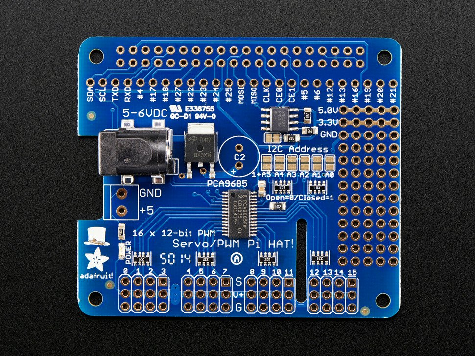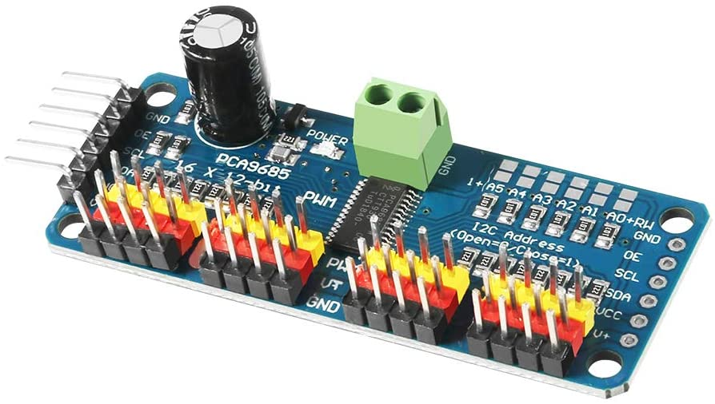

I2C address = 0x40 (64) - 0x7E (126)

channels = 0 - 15

16 Channel PWM controller over I2C

(can be used for servos with addition of power supply and capacitor or just PWM without)

*Note*: The Adafruit hats are nice because they have 1. A barrel power connector 2. Plenty of extra perfboard to run extra power, grounds, I2C connections, etc. The Modules have bad power connectors, but are cheaper and come with a capacitor already installed. The Modules are actually really good for LEDs since they don't need a lot of power and can run the LEDs without a power supply atttached.

Required
---

>sudo pip3 install adafruit-circuitpython-servokit

Documentation
---

<https://learn.adafruit.com/adafruit-16-channel-pwm-servo-hat-for-raspberry-pi>\
<https://docs.circuitpython.org/projects/pca9685/en/latest/api.html>

\
\
**---LED---**
---

The LEDs in the buttons above or any 3.3-5v LED

Uses just one pin that is either HIGH (on) or LOW (off). Can be connected to any input pin on the PI or GPIO Expander. If it's connected to a PWM board, the dutycycle should be 0 for off and 0xffff or 65535 for on. I also saw 4095 somewhere so maybe theres a way to set the resolution.

\
\
**---PWMLED---**
---

The LEDs in the buttons above or any 3.3-5v LED\
Uses just one pin that needs to be Pulse With Modulated to generate a brightness.\
This can be done using gpiozero if connected directly to the pi, dutycycle if connected to a PWM board, and software PWM if connected to a GPIO expander.

\
\
**---RGBLED---**
---

The LEDs in the RGB buttons above or any 3 pin RGB LED\
Uses 3 pins that can be on or off, or Pulse With Modulated to create any color through RGB.\
GPIOZERO has an RGBLED class but it only works with the pins on the pi. With the PWM board it could be done using dutycycle, and software PWM with the GPIO Expander.

\
\
**---RELAY---**
---

[3-32VDC to 24-480V AC 40Amp](https://www.amazon.com/BEM-14840DA-3-32V-24-480V-Output-Single/dp/B00E1LC1VK/")

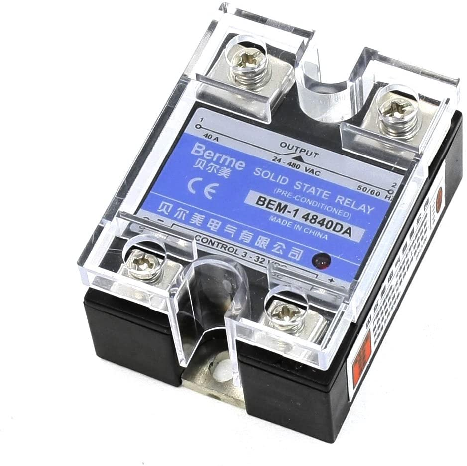

Used for switching on and off dust collectors, vacuums, lights, etc. But can also be used to open and close Solenoids, like to open the gas hose for welding, or for lots of different pneumatic uses, like pumping up jacks or metal bending machines.

Uses one pin and can be HIGH or LOW. If using a PWM board, must set to max and min or it may damage the device.

*Note*: Solid State relays (linked and pictured) work really well at low voltages, but switching relays will work as well.

*Note*: It's important to make sure that the relay is rated for the application. A lot of relays are DC controlled, but only control DC. Find a DC to AC relay.

*Note*: For 220V tools like a dust collector, there are dual channel relays, but they seem to mostly be very cheap. The better option I've found is using 2 matching relays and connecting each of the hots to one relay, and the pin to both relays. That way the pin triggers both relays at the same time which allows both hots to be on at the same time as well.

\
\

-----

SOFTWARE
===

**---Triggers---**
---

**Button**

address = GPIO on pi, or GPIO Expander set to INPUT\
momentary type button so only toggles current state\
1 pin - may need a pullup resistor unless it comes with one. Many buttons have 2 SPST switchs.  

\
**GUI_Button**

address = in GUI implementation\
no pins

**GUI_Gate_Button(GUI_Button)**

**GUI_Tool_Button(GUI_Button)**

\
**AD_Converter**

address = I2C to AD_Converter (ADS1115 or ADS1105)\
Only requires I2C but also has an ALRT pin on it that might could be attached to the pi to help with identifing voltage changes.

\
**Voltage_Sensor(AD_Converter)**

SubClass of AD_converter\
address = AD converter plus a pin P0 - P3\
Connects to AD Converter via 1 pin.\
*note* This device does not actually talk to the pi. It talks to the AD Converter so to query it would require talking to the AD converter it's connected to.

\
\
**---Listeners---**
---

**GUI_Button**

This will need SubClasses for tool buttons, light buttons, settings, etc.

**GUI_Gate_Button(GUI_Button)**

**GUI_Tool_Button(GUI_Button)**

\
**Relay**

address = GPIO on pi, PWM controller, or GPIO expander\
1 pin - high = on\

\
**Light(Relay)**

SubClass of Relay\
address = GPIO on pi, PWM controller, or GPIO expander\
1 pin - high = on\
Specific type of relay that controls a light\

\
**DustCollector(Relay)**

SubClass of Relay\
address = GPIO on pi, PWM controller, or GPIO expander\
1 pin - high = on\
Specific type of relay that controls the dust collector\

\
**Led**

address = GPIO on pi, PWM Controler, GPIO Expander\
1 pin - high = on\

\
**PWMLed(Led)**

SubClass of LED\
address = GPIO on pi (with software PWM), or PWM Controller (possilby GPIO Expander with some software PWM)\
1 pin - PWM or software PWM\

\
**RGBLed(led)**

SubClass of LED\
address = GPIO on pi (with software PWM), or PWM Controller (possilby GPIO Expander with some software PWM)\
3 pins - PWM or software PWM\

\
**Servo**

address = PWM Controller WITH power supply\
1 pin - duty cycle or angle if using SERVOKIT\

\
**Gate(Servo)**

SubClass of Servo\
address = PWM Controller WITH power supply\
1 pin - duty cycle or angle if using SERVOKIT\
